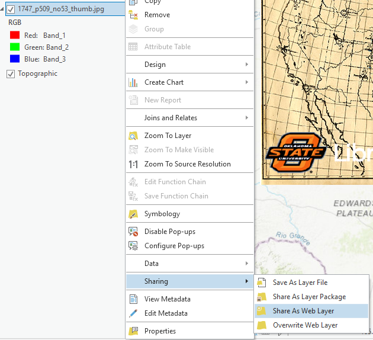

## About
Last Updated *[add date here]*   
Created by [OSU Maps and Spatial Data](https://info.library.okstate.edu/map-room)

## Table of Contents
- Introduction 
- *[Publishing a Georeferenced Map]*
- Conclusion
- Further Reading/Resources

## Introduction
ArcGIS Pro allows completed projects to be published online or shared with others. ArcGIS Online is a common publishing platform. For more information on how to georeference maps, go to (add link).

## *[Publishing a Georeferenced Map]*
1. Open a georeferenced map in ArcGIS Pro. Make sure it is highlighted/selected in the *Contents* pane.
2. Double check the georeferencing and add any additional points if necessary.

*Note: A minimum of four control points should be placed. **Spline** is the preferred transformation for accuracy and requires 10 or more control points, but there are other transformations when this number of control points is not possible. The more control points that are added, the more precise the transformation will be. Also, it is best to have the control points evenly distributed throughout the map to reduce the chances of transformation error.*

3. Right click the map layer in *Contents*, then **Sharing** and **Share As Web Layer**.

4. Name the file, add a summary and add tags as desired.
5. Set the *Layer Type* to **Tile**
9. Choose a folder for the file.
10. Check **Everyone** under *Share with*.

11. Now click **Configuration** at the top, next to *General*.

12. Set the *Levels of Detail* and ensure that the **estimated cache size** is less than 1GB.

13. Check **Allow clients to export cache tiles**, and leave the value at the default of *100000*.

14. Now click the **Analyze** button.

15. Click **Publish** if there are no major errors.

*Note: Publishing may take some time. Once it is a finished, a pop up should appear that says publishing was successfull.*

## Conclusion
ArcGIS Pro offers numerous options when it comes to sharing or publishing projects.

## Further Reading/Resources

[Return to Top](#about)
